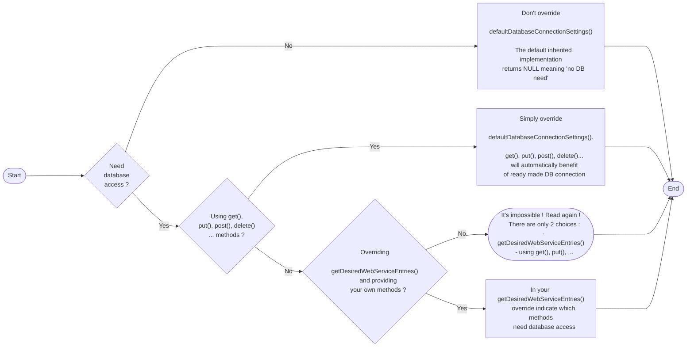
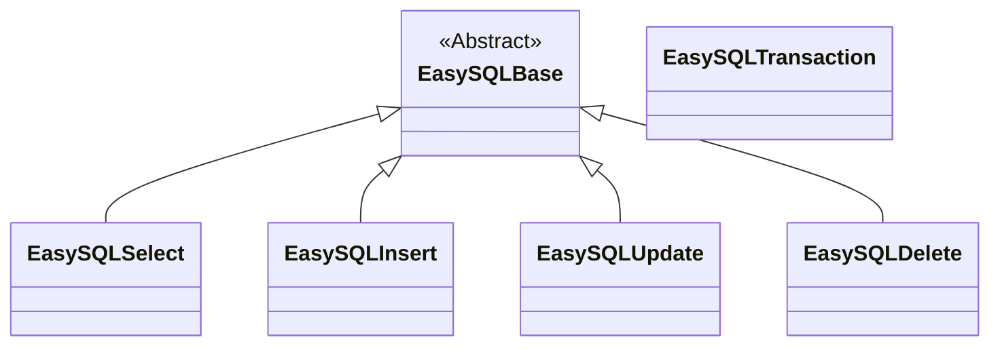

# What is `easy-php-ws` ?
**Dead simple** 👍 solution to **quickly** create **fast** and powerful **RESTFul web-services** in **PHP**.

Want to provide a `GET`, `POST`, `PUT`, `DELETE`, ... web-service entries ?

As easy as overriding methods ! Enjoy 😙 
```PHP
$myWebService = new class extends EasyWebService {
    public function get ( array $input ) {
        return 'Now is ' . date( 'd.m.Y' ) . '@' . date( 'H:i:s' );
    }
};
```
Read on !

And in case you need to talk to a MySQL database (or any other), this library should also greatly simplify your task.

# Table of contents
1. [Introduction](#introduction)
2. [How to use easy-php-ws ?](#how-to-use-easy-php-ws)
    - [General idea to make it work](#general-idea-to-make-it-work)
    - [Small CRUD example to handle a person](#small-crud-example-to-handle-a-person)
    - [How to retrieve GET parameters and/or POST payload when called ?](#how-to-retrieve-get-parameters-andor-post-payload-when-called)
    - [How to return JSON data ?](#how-to-return-json-data)
    - [How to return 200/OK or any other http error code ?](#how-to-return-200ok-or-any-other-http-error-code)
    - [Wanting several web-service entries within the same PHP script ?](#wanting-several-web-service-entries-within-the-same-php-script)
    - [Need to connect to a MySQL database ?](#need-to-connect-to-a-mysql-database)
        - [Extra tweaking of database connection details](#extra-tweaking-of-database-connection-details)
    - [Using database SQL queries](#using-database-sql-queries)
    - [Example using many entries, different naming and database](#example-using-many-entries-different-naming-and-database)
3. [How to install, configure and debug easy-php-ws ?](#how-to-install-configure-and-debug-easy-php-ws)
    - [Installation](#installation)
    - [Configuration](#configuration)
    - [Debugging](#configuration)
4. [Easy SQL queries classes](#easy-sql-queries-classes)
    - [EasySQLSelect](#easysqlselect)
    - [EasySQLInsert](#easysqlinsert)
    - [EasySQLUpdate](#easysqlupdate)
    - [EasySQLDelete](#easysqldelete)
    - [EasySQLTransactions](#easysqltransactions)
5. [About it](#about-it)


# Introduction
Say you want to create a `http://www.mysite.com/api/greetings/` web-service, providing greetings to the caller only through the http `GET` protocol.

Super easy 😙 :
- make your script import the `easy-php-ws` library
- override the `get()` method
- don't forget to call execute()

 Here is the corresponding code of this `/api/greetings/index.php`  :
```PHP
<?php
    require_once( __DIR__ . '/../lib/EasyWebService.php' );

    $myWebService = new class extends EasyWebService {
        
        public function get ( array $input ) {
            return 'Welcome ' . ( isset( $input['name'] ) ? $input['name'] : 'stranger' ) . ' !';
        }

    };
    
    $myWebService->execute();
?>
```
That's it !

Now you can call it like this :
```
http://www.mysite.com/api/greetings/
http://www.mysite.com/api/greetings/?name=Paul
http://www.mysite.com/api/greetings/index.php?name=Paul
```
and that would produce :
```
"Welcome stranger !"
"Welcome Paul !"
"Welcome Paul !"
```

# How to use `easy-php-ws` ?
## General idea to make it work
Here it is, simply : 
1. inherit from `EasyWebService` base class
    - this will give you all standard functionality and default behaviour
2. implement your web-service entries simply by overriding `get()`, `post()`, ...
    - methods to override are easy to remember : they have the same name as the http protocol you want to support (`GET`, `POST`, `PUT`, `DELETE` , ...) 😙
3. Optional : decide to go with extra naming flexibility, extra protocol support possibilities, ... and override `getDesiredWebServiceEntries()`

> **DEAD SIMPLE ! Really !** 👍

Read on !

## Small `CRUD` example to handle a person
Sometimes a chunk of code explains it all way better than text...

Here is basically all you need to do to produce a set of CRUD entries to handle requests on persons :
```PHP
<?php
require_once( __DIR__ . '/../lib/EasyWebService.php' );

$myWebService = new class extends EasyWebService {

    public function post( array $input ) {
        // Of course here we should now create the person within a database, within a file...
        // Let's say it has been done ;-) and now return the newly created PK
        return array( 'status' => 'OK', 'PK' => 123 );
    }

    public function get( array $input ) {
        // Of course here we should now read the person having that provided PK or return all of them...
        // Let's say it has been done ;-) and now return that freshly read data
        return array(
            'status' => 'OK',
            'person' => array( 'PK' => 123, 'name' => 'Disney', 'forename' => 'Walt' )
        );
    }
    
    public function put( array $input ) {
        // Of course here we should update the person having that provided PK...
        // Let's say it has been done ;-) and now return the status
        return array( 'status' => 'OK', 'affected-rows' => 1 );
    }

    public function delete( array $input ) {
        // Of course here we should permanently delete the person having that PK...
        // Let's say it has been done ;-) and now return the status
        return array( 'status' => 'OK', 'affected-rows' => 1 );
    }
};

$myWebService->execute();
?>
```

## How to retrieve `GET` parameters and/or `POST` payload when called ?
**Super easy** and independent of the used protocol 😙 !

The `easy-php-ws` library does the job for you ! 
- any key/values parameters passed on through URL during a `GET` http request will be available in the `$input` array as key/value pairs passed to your web-service entry when called
- any parameter passed on via JSON payload (typically when using a `POST` http request) will also be available in the `$input` array as key/value pairs passed to your web-service entry when called

**You have nothing to do to retrieve them** 👍, simply use `$input` that'll contain all passed input data, independently of the protocol used to call the method :-)

In case a parameter has been specified twice, through `GET` key/values parameters passed on the URL **AND** through a JSON payload, `easy-php-ws` will retain the latter one (JSON payload).

> Yes, just in case you did not know that, http `GET` calls can also have payloads, they are not limited to only URL key/values pairs (although not often done).

## How to return JSON data ?
Good news : `easy-php-ws` **does it automatically** for you !

Any data returned by your web-service entries methods will automatically be tranformed into `JSON` before reaching the caller.  
Therefore the `getstuff.php` script below :
```PHP
<?php
require_once(__DIR__ . 'EasyWebService.php');

$myWebService = new class extends EasyWebService {
    public function get( array $input ) {
        return array(
            'text' => 'Welcome stranger !',
            'isMale' => true,
            'age' => 54,
            'weight' => 88.88,
            'values' => array(1, 2, 3, 4, 5, 6, 7, 8, 9, 10),
            'date' => date('d.m.Y'),
            'time' => date('H:i:s')
        );
    }
};

$myWebService->execute();
?>
```
when called with `GET` http protocol :
```
http://www.mysite.com/api/getstuff.php
```
will automatically produce the following `JSON` content when called :
```JSON
{
    "text": "Welcome stranger !",
    "isMale": true,
    "age": 54,
    "weight": 88.88,
    "values": [
        1,
        2,
        3,
        4,
        5,
        6,
        7,
        8,
        9,
        10
    ],
    "date": "26.04.2023",
    "time": "11:42:12"
}
```
## How to return `200/OK` or any other http error code ?
That's very simple to do.

Keep in mind that :
- by default, if you don't say otherwise, http result code `200/OK` will be sent automatically.
- you can change that by calling `setHttpResultCode()`

Like this :
```PHP
<?php
    require_once( __DIR__ . '/../lib/EasyWebService.php' );

    $myWebService = new class extends EasyWebService {
        
        public function get ( array $input ) {

            if ( !isset( $input[ 'name' ] ) {

                // Change the http error code to... 417/Expectation Failed
                $this->setHttpResultCode( 417 );

                // That's valid JSON too (could be NULL, boolean, int, double, string, table or associative array)
                return NULL;    
            }

            return 'Welcome ' . $input['name'] . ' !';
        }

    };
    
    $myWebService->execute();
?>    
```

## Wanting several web-service entries within the same PHP script ?
Super easy again :
1. implement your methods using whatever names you prefer 😙
2. override `getDesiredWebServiceEntries()` to specify all your web-service entries names at once, with desired http protocols, database needs, ...  all in one place.

```PHP
    ...
    public function getDesiredWebServiceEntries() : array {
        return array(
            array(
                'request' => 'myMethodNr1',                               // Mandatory
                'protocols' => array( 'GET', 'POST' ),                    // Mandatory, any of 'POST', 'PUT', 'PATCH', 'DELETE', 'HEAD', 'GET'
                'php-method' => 'myMethodNr1RealNameWithinThisPHPClass',  // Optional, by default same as 'request' value
                'needDB' => TRUE                                          // Optional, FALSE by default
            ),
            ...
            ...
        );
    }
    ...
```

It is then very easy to call your web-service entry this way :
```
http://www.mysite.com/api/abovescript.php?request=myMethodNr1&parm1=blabla&parm2=blibli
```

Of course, `easy-php-ws` will check and complain if the http protocol used is not allowed by your web-service entry.

Last but not least, if you don't like the key name `'request'` for identifying and triggering execution of your web-service entries, no problemo : simply change it !

Simply override `defaultRequestVerb()` like this and voilà 😙 !
```PHP
    ...
    public function defaultRequestVerb() : string {
        return 'IPreferThisName';
    }
    ...
    public function getDesiredWebServiceEntries() : array {
        return array(
            array(
                'IPreferThisName' => 'myMethodNr1',                       // Mandatory
                'protocols' => array( 'GET', 'POST' ),                    // Mandatory
                'php-method' => 'myMethodNr1RealNameWithinThisPHPClass',  // Optional, by default same as 'request' value
                'needDB' => TRUE                                          // Optional, FALSE by default
            ),
            ...
            ...
        );
    }
    ...
```

Again easily callable this way :
```
http://www.mysite.com/api/abovescript.php?IPreferThisName=myMethodNr1&parm1=blabla&parm2=blibli
```

[Please see a more complete example here](#example-using-many-entries-different-naming-and-database)

## Need to connect to a MySQL database ?
Super easy again :
1. override `defaultDatabaseConnectionSettings()` to provide the needed credentials to connect to the database, like this :  
```PHP
    ...
    public function defaultDatabaseConnectionSettings() : array {
        return array(
          'host' => 'your hostname',
          'dbname' => 'your database name',
          'username' => 'your username',
          'password' => 'your password
      );
    }
    ...
```
done :-)

2. In case you are using `get()`, `put()`, `post()`, `delete()` ... then the `easy-php-ws` library will automatically connect to your database just before calling those web-service entries and, of course, automatically disconnect right after the call has been made.  
This  means that your overrides of `get()`, `put()`, `post()`, `delete()` ... will automatically benefit from being connected to your database without extra work from you.
3. And in case you are using your own specific web-service entries defined with `getDesiredWebServiceEntries()` you have extra flexibility and speed. This way you can explicitly ask for database support (or not), as not all your web-service entries may need it. Simply add `'needDB' => TRUE` to your entries definitions that need database and voilà !

The same said with a flowchart to make it clear :

### Extra tweaking of database connection details
The automatic connection and disconnection to/from the database is done through two internal methods `databaseConnect()` and `databaseDisconnect()` that are overridable.

By default and among other things, they prepare the database communication channel with UTF-8 character set.

Again don't hesitate to override them to behave differently, to connect to another kind of database, ... Here is the current default behaviour :
```PHP
    ...
    /**
     * Default implementation of database connection, here using MySQL code. Feel free to override it to change behaviour (other parameters or kind of database).
     * The DB channel will be set to UTF-8 and LC_TIME_NAMES configured to produce French results. Feel free to override.
     * 
     * @param string $host database host
     * @param string $dbname database name
     * @param string $username database username
     * @param string $password database password
     * @return bool true if successfully connected
     */
    public function databaseConnect( string $host, string $dbname, string $username, string $password ) : bool {
        $successfull = false;

        // Connect to database with default implementation relying on mysqli.
        // Simply ovverride this method if other database or settings are desired.
        if ( ( $this->dbConnection = mysqli_connect( $host, $dbname, $username, $password ) ) == true ) {
            // Force UTF8 database communication at all levels
            mysqli_query( $this->dbConnection, 'SET NAMES utf8' );
            mysqli_query( $this->dbConnection, 'SET CHARACTER SET utf8' );
            mysqli_set_charset( $this->dbConnection, 'utf8' );
            mysqli_query( $this->dbConnection, "SET LC_TIME_NAMES= 'fr_FR'" ); // To get day names in french with DATE_FORMAT()
            // Make sure we are using the correct database
            mysqli_query( $this->dbConnection, 'USE ' . $dbname );

            $successfull = true;
        }

        return $successfull;
    }

    /**
     * Default implementation of database disconnection, here using MySQL code. Feel free to override it to change behaviour (other parameters or kind of database).
     * 
     * @return void
     */
    public function databaseDisconnect() : void {
        if ( !is_null( $this->dbConnection ) ) {
            mysqli_close( $this->dbConnection );
            $this->dbConnection = null;
        }
    }
    ...
```

[Please see a more complete example here](#example-using-many-entries-different-naming-and-database)

## Using database SQL queries
As said before, when asked to do so `easy-php-ws` automatically connects to the database just before calling your web-service entry method (and disconnect right after having called you).

Within your web-service entry simply use the already connected `$this->dbConnection` attribute for your database queries. You could to it simply like this :

```PHP
<?php
    ...    
    public function get( array $input ) {
        ...
        // Do a SQL query using the database connection 
        $res = mysqli_query( $this->dbConnection, 'SELECT blabla... FROM ...' )...
        ...
        return $result;
    }
    ...
?>
```
But please [read the section below on EasySQL helpers](#easy-sql-queries-classes), as it may speedup and simplify your code for doing that kind of things.

## Example using many entries, different naming and database
Here is a small example `/api/demos/demo.php`. This is what it does :
- defining multiple web-service entries (done in `getDesiredWebServiceEntries()`)
    - some web-service entries need automatic database connection/disconnection (using the `'needDB'` key)
    - one web-service entry use a specific internal name (using the `'php-method'` key)
- defining database connection credentials (done in `defaultDatabaseConnectionSettings()`)
```PHP
<?php

require_once( __DIR__ . '/../lib/EasyWebService.php' );

$myWebService = new class extends EasyWebService {

    public function defaultRequestVerb() : string {
        return 'request';
    }

    public function getDesiredWebServiceEntries() : array {
        return array(
            // To get welcomed
            array( 'request' => 'greeting', 'protocols' => array( 'GET', 'POST' ) ),
            // To get server date (but using a different method name :-)
            array( 'request' => 'serverDate', 'protocols' => array( 'POST' ), 'php-method' => 'serverDateHandler' ),
            // CRUD Person (they all need a database connection)
            array( 'request' => 'create_Person', 'protocols' => array( 'POST' ), 'needDB' => TRUE ),
            array( 'request' => 'read_Person', 'protocols' => array( 'GET' ), 'needDB' => TRUE ),
            array( 'request' => 'update_Person', 'protocols' => array( 'PUT' ), 'needDB' => TRUE ),
            array( 'request' => 'delete_Person', 'protocols' => array( 'DELETE' ), 'needDB' => TRUE ),
        );
    }

    public function defaultDatabaseConnectionSettings() : array {
        return array(
          'host' => 'your hostname',
          'dbname' => 'your database name',
          'username' => 'your username',
          'password' => 'your password
      );
    }
    
    public function greeting( array $input ) {
        return 'Welcome ' . ( isset( $input[ 'name' ] ) ? $input[ 'name' ] : 'stranger' ) . ' !';
    }

    // Notice the name change, not using 'serverDate' as by default but using 'php-method' key 
    public function serverDateHandler( array $input ) {    
        return array( 'server-date' => date( 'd.m.Y' ) );
    }

    public function create_Person( array $input ) {
        // Of course here we should now create the person within a database of file...
        // Let's say it has been done ;-) and now return the newly created PK
        return array( 'status' => 'OK', 'PK' => 123 );
    }

    public function read_Person( array $input ) {
        // Of course here we should now read the person having the provided PK...
        // Let's say it has been done ;-) and now return that freshly read data
        return array(
            'status' => 'OK',
            'person' => array( 'PK' => 123, 'name' => 'Disney', 'forename' => 'Walt' )
        );
    }

    public function update_Person( array $input ) {
        // Of course here we should update the person having the provided PK...
        // Let's say it has been done ;-) and now return the status
        return array( 'status' => 'OK' );
    }

    public function delete_Person( array $input ) {
        // Of course here we should permanently delete the person having that PK...
        // Let's say it has been done ;-) and now return the status
        return array( 'status' => 'OK' );
    }
};

$myWebService->execute();

?>
```
> That's it ! **DEAD SIMPLE ! Really !** 👍

Now you could call that `/api/demos/demo.php` script with `GET` protocol like this :
```
http://www.mysite.com/api/demos/demo.php?request=serverDate
```
...that will call `serverDateHandler()` and produce :
```JSON
{
    "server-date" : "26.10.1968"
}
```

# How to install, configure and debug `easy-php-ws` ?
## Installation
This `easy-php-ws` library uses only what is natively provided by `PHP`. It does not depend on any other library nor use any.

To install it on your web-server, simply copy `EasyWebService.php` (preferably within a `lib` folder). Then make your classes use it like demonstrated above.

## Configuration
At the moment (v2.0.2), there is no need to be able to configure anything. Therefore nothing can be configured with this `easy-php-ws` library, except the [enabling or disabling of the internal debugging/logging feature](#debugging).

## Debugging
This `easy-php-ws` library provides a switch to enable or disable the internal debugging/logging feature.

```PHP
...
// To activate internal debugging 
define( 'EWS_DEBUGGING_ACTIVATED', FALSE );
define( 'EWS_DEBUGGING_FILENAME', 'ews_debug.txt' );
...
```
 When activated, the log file will be generated nearby your class.
 
 This feature can be helpful in those cases where it is difficult to understand what is going on with a web-service entry point not working as expected.

## Running the tests
Under `/tests/easy-php-ws/` folder lies the `run-all-tests.php` script meant to launch all the testing machinery to verify that the library still works as expected. You can see it as a kind of "unit testing". It produces human readable HTML and is usefull to test to see if everything is working as expected, for example against new PHP versions, against new website settings, ...

Simply first edit the `$WSHOME` variable on top of the `run-all-tests.php` script to make it point to **YOUR** test folder.
```PHP
// Please specify here the location of the tests/test folder
$WSHOME = 'https://www.mywebsite.com/folder/folder/easy-php-ws/tests/test';
```
and if desired you can also change the output `verbosity` with those 3 settings also on top of the same script :

```PHP
$verbose             = TRUE;
$verboseOnlyIfFailed = TRUE; // TRUE to turn off $verbose in case everything is fine...
$showURLUnderTitle   = TRUE;
```

⛔️ Don't touch the content of `/tests/easy-php-ws/test` folder. It contains some simple scripts providing all necessary web-services entries to be tested by the stress-tester `run-all-tests.php`.

Try ! Copy the whole on your webserver, edit the `$WSHOME` variable and then point your browser at :
```
https://www.mywebsite.com/where-it-is-located/tests/easy-php-ws/run-all-tests.php
```
to get a functional report directly on screen.

# Easy SQL queries classes
The `easy-php-ws` library comes with a bunch of classes that should ease the task of doing SQL with a database.

Those classes are separated from the `EasyWebService` class. Which means you can decide to use them (or not).

As you know, the code needed to do SELECT, INSERT, UPDATE and DELETE queries is mostly always boringly the same. From time to time, it doesn't change a lot in structure.

This is why we all do it : open another project where we already did some queries, then copy that code, paste it, modify, copy, paste, modify, ... Boring and error prone as errors still have to be handled correctly !

**The idea here is to avoid having to write almost the same code over and over again**, just to do some SQL.

What if you could do that without writing SQL code, simply by expressing your wishes and letting a class do most of the technical job for you ?

That's exactly the idea behind this set of classes : they try to do the boring and error prone stuff and let you express and decide about what really matters and counts.
## EasySQL helper classes
### EasySQLSelect
#### Usage example :
```PHP
...
    public function get( array $input ) {

        $query = "SELECT id, DATE_FORMAT( msg_date, '%Y-%m-%d %H:%i:%s' ) as msg_date, msg_content FROM t_demo ORDER BY msg_date DESC";

        return EasySQLSelect::execute(
            array(
                'request' => array(
                    'connect'            => $this->getDBConnection(),
                    'sql'                => $query,
                    'sql-is-using-parms' => FALSE
                ),
                'results' => array(
                    'wanted-columns' => array(
                        'id'          => 'integer',
                        'msg_date'    => 'string',
                        'msg_content' => 'string'
                    )
                )
            )
        );
    }
...
```
#### Explanations:
Usage, mandatory and optional parameters are already explained in EasySQLSelect.php class file.

More will soon be done here...
### EasySQLInsert
#### Usage example :
```PHP
...
    public function post( array $input ) {

        $query = "INSERT INTO t_demo ( msg_date, msg_content ) VALUES ( NOW(), '###1###' )";

        return EasySQLInsert::execute(
            array(
                'request' => array(
                    'connect'            => $this->getDBConnection(),
                    'sql'                => $query,
                    'sql-is-using-parms' => TRUE,
                    'parms'              => array(
                        array(
                            'to-find'     => '###1###',
                            'replace-by'  => $input[ 'msg_content' ],
                            'must-escape' => TRUE,
                            'must-trim'   => TRUE
                        )
                    )
                )
            )
        );
    }
...
```
#### Explanations:
Usage, mandatory and optional parameters are already explained in EasySQLInsert.php class file.

More will soon be done here...
### EasySQLUpdate
#### Usage example :
```PHP
...
    public function put( array $input ) {

        $query = "UPDATE t_demo SET msg_content = '###2###' WHERE id = ###1###";

        return EasySQLUpdate::execute(
            array(
                'request' => array(
                    'connect'            => $this->getDBConnection(),
                    'sql'                => $query,
                    'sql-is-using-parms' => TRUE,
                    'parms'              => array(
                        array(
                            'to-find'     => '###1###',
                            'replace-by'  => $input[ 'id' ],
                            'must-escape' => TRUE,
                            'must-trim'   => FALSE,
                        ),
                        array(
                            'to-find'     => '###2###',
                            'replace-by'  => $input[ 'msg_content' ],
                            'must-escape' => TRUE,
                            'must-trim'   => TRUE,
                        )
                    )
                )
            )
        );
    }
...
```
#### Explanations:
Usage, mandatory and optional parameters are already explained in EasySQLUpdate.php class file.

More will soon be done here...
### EasySQLDelete
#### Usage example :
```PHP
...
   public function delete( array $input ) {

        $query = "DELETE FROM t_demo WHERE id = ###1###";

        return EasySQLUpdate::execute(
            array(
                'request' => array(
                    'connect'            => $this->getDBConnection(),
                    'sql'                => $query,
                    'sql-is-using-parms' => TRUE,
                    'parms'              => array(
                        array(
                            'to-find'     => '###1###',
                            'replace-by'  => $input[ 'id' ],
                            'must-escape' => TRUE,
                            'must-trim'   => FALSE,
                        )
                    )
                )
            )
        );
    }
...
```
#### Explanations:
Usage, mandatory and optional parameters are already explained in EasySQLDelete.php class file.

More will soon be done here...
### EasySQLTransactions
#### Usage example :
#### Explanations:
More will soon be done here...

# About it
It all started (more or less 10 years ago) when I was in search of support for producing web-services simply, quickly and efficiently.

The web was (and still is) full of libraries and frameworks to generate RESTful web-services (all claiming to be better than the other ones ;-) but I found that they were all **way too complicated** and/or **way too heavy** and/or **having way too many constraints** for my needs.

That's why I decided to develop my own solution that I have then successfully used in many projects. I wrote the first version of this library because I wanted something :
- super easy to use and extra simple to understand
- efficient but flexible
- extensible
- last but not least, something based on what is always available on all hosting platforms : `PHP`.

This year I took the decision to share it and to port it on GitHub. Here it is !

> I sincerely hope it will be of any help for your needs too.

I've worked hard 😅 to make it simple and as easy as possible to use, compact and yet extensible through overridable methods and now it's even more or less documented.

I would therefore be glad to hear your suggestions to further improve it !
